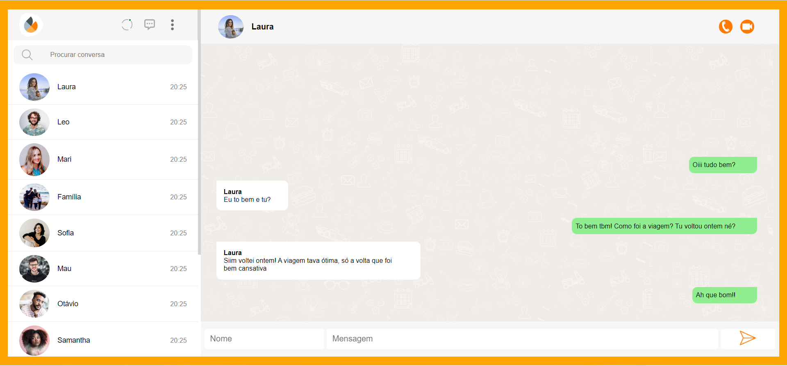

# WhatsLab (inspired by WhatsApp)
This project is a messaging app that was inspired by whatsapp.

## Functionalities:
* A field to type the name and another field to type the message;
* A button to send the message;
* Press the enter key to send the message;
* When typing the name 'Eu' or 'eu', the message is rendered on the right side of the screen with a green background;
* When typing any other name, the message is rendered on the left side of the screen with a white background;
* When hovering over the message, a button appears. If the user clicks on the button, the message is deleted;
* This project is responsive to all screen sizes.

## Link to access the project:
http://mighty-invention.surge.sh/

## Installing
<pre>
  <code>$ git clone https://github.com/francinehahn/whatslab-inspired-by-whatsapp.git</code>
</pre>

<pre>
  <code>$ cd whatslab-inspired-by-whatsapp</code>
</pre>

<pre>
  <code>$ npm install</code>
</pre>

## Images:

### Desktop version

### Mobile version

